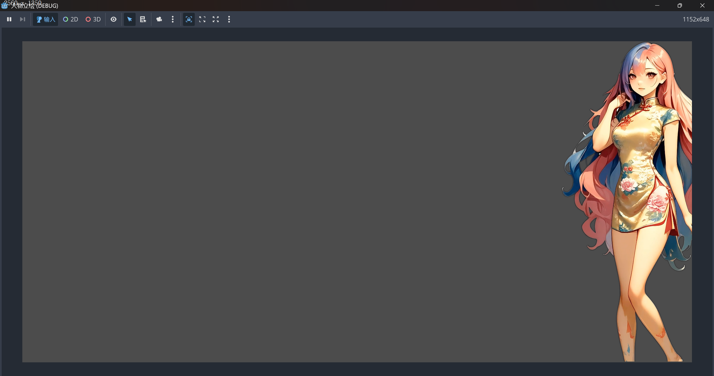

# Portix - Live2D风格角色动画项目


一个使用Godot引擎制作的Live2D风格角色呼吸动画项目，展示了一个可爱的女孩角色的自然呼吸起伏效果。

## 📖 项目简介

这个项目实现了类似Live2D的角色动画效果，通过一系列精心制作的帧动画，展现了角色自然的呼吸动作。项目包含了完整的动画循环，配合舒缓的背景音乐，营造出温馨的氛围。

## ✨ 特性

- 🎭 **流畅的角色动画** - 37帧精心制作的呼吸动画
- 🔄 **无缝循环播放** - 正向和反向播放实现完美循环
- 🎵 **背景音乐** - 配有"Silent Ocean Waves"舒缓音乐
- 🎨 **高质量美术** - 2.7MB高分辨率PNG帧图像
- 📱 **移动端优化** - 使用Godot移动渲染器优化性能

## 🛠️ 技术栈

- **游戏引擎**: Godot 4.4
- **渲染方式**: Mobile Renderer
- **图像格式**: PNG (透明背景支持)
- **音频格式**: OGG
- **源文件**: XCF (GIMP格式)

## 📁 项目结构

```
portix/
├── main.tscn                    # 主场景文件
├── project.godot               # Godot项目配置
├── icon.svg                    # 项目图标
├── outputs/                    # 动画帧输出目录
│   ├── my_girl_000.png        # 动画帧 (000-036)
│   ├── my_girl_001.png
│   └── ...
├── bgm/                        # 背景音乐目录
│   └── Silent Ocean Waves 欢快版本.ogg
├── xcf_backup/                 # GIMP源文件备份
└── outputs_backup.zip          # 输出文件备份
```

## 🚀 快速开始

### 环境要求

- Godot Engine 4.4 或更高版本
- 支持移动端渲染的设备

### 运行项目

1. **克隆项目**
   ```bash
   git clone https://github.com/yourusername/portix.git
   cd portix
   ```

2. **打开项目**
   - 启动Godot Engine
   - 点击"导入"按钮
   - 选择项目目录中的`project.godot`文件
   - 点击"导入并编辑"

3. **运行游戏**
   - 在Godot编辑器中按`F5`键
   - 或点击右上角的"播放"按钮

## 🎮 使用说明

项目运行后，您将看到：
- 一个可爱的女孩角色在屏幕中央
- 角色会自动播放呼吸动画（类似Live2D效果）
- 背景播放舒缓的海浪音乐
- 动画会无限循环播放

## 🎨 动画制作流程

1. **原始设计** - 使用GIMP创建角色基础设计
2. **帧制作** - 制作37帧呼吸动画关键帧
3. **导出优化** - 导出为PNG格式保持透明度
4. **Godot集成** - 使用AnimatedSprite2D组件播放动画
5. **循环优化** - 实现正向反向播放的无缝循环

## 📊 性能数据

- **动画帧数**: 37帧
- **循环时长**: 约3-4秒
- **文件大小**: 
  - 单帧: ~2.7MB (PNG)
  - 总资源: ~287MB (压缩备份)
- **内存占用**: 优化后适合移动设备运行

## 🔧 自定义修改

### 修改动画速度
在`main.tscn`中找到AnimatedSprite2D节点，调整`speed_scale`属性：
```gdscript
# 加快动画
$AnimatedSprite2D.speed_scale = 2.0

# 减慢动画  
$AnimatedSprite2D.speed_scale = 0.5
```

### 替换背景音乐
1. 将新的音频文件放入`bgm/`目录
2. 在场景中更新AudioStreamPlayer的stream属性

### 添加新动画帧
1. 在GIMP中编辑XCF文件
2. 导出为PNG格式到`outputs/`目录
3. 在Godot中更新SpriteFrames资源

## 🤝 贡献指南

欢迎提交Issue和Pull Request！

1. Fork本项目
2. 创建特性分支 (`git checkout -b feature/AmazingFeature`)
3. 提交更改 (`git commit -m 'Add some AmazingFeature'`)
4. 推送到分支 (`git push origin feature/AmazingFeature`)
5. 开启Pull Request

## 📄 许可证

本项目采用MIT许可证 - 查看 [LICENSE](LICENSE) 文件了解详情

## 🙏 致谢

- 感谢Godot社区提供的优秀游戏引擎
- 感谢所有为Live2D技术发展做出贡献的开发者
- 背景音乐: "Silent Ocean Waves 欢快版本"

## 📞 联系方式

如有问题或建议，请通过以下方式联系：

- 提交Issue: [GitHub Issues](https://github.com/yourusername/portix/issues)
- 邮箱: your.email@example.com

---

⭐ 如果这个项目对您有帮助，请给个Star支持一下！
